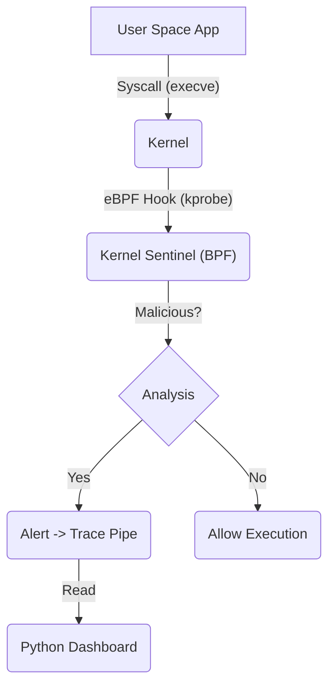

# Kernel Sentinel // eBPF Process Monitor & Rootkit Detector


**Kernel Sentinel** is an advanced Linux security tool that leverages **eBPF (Extended Berkeley Packet Filter)** to hook low-level syscalls directly in the kernel. It provides real-time detection of rootkits, unauthorized process execution, and sensitive file access with zero overhead.

> **Disclaimer**: Requires Root privileges. 

---

## 🚀 Features

### 1. Kernel-Level Visibility (C/eBPF)
*   **Syscall Hooking**: Uses `kprobe` to intercept `__x64_sys_execve` and `__x64_sys_openat`.
*   **Stealth Detection**: Detects malicious patterns *before* they return to user space.
*   **Bypass Resistant**: Monitors the kernel trace pipe, bypassing standard user-space hook evasion techniques (like LD_PRELOAD).

### 2. Detection Logic
*   **Malicious Binaries**: Flags execution of recon tools (`nmap`, `ncat`, `whoami`, `tcpdump`).
*   **File Integrity**: Alerts on access to sensitive files (`/etc/shadow`, `/etc/passwd`).
*   **Rootkit Loading**: Detects `insmod` attempts (Kernel Module Loading).

### 3. Sentinel Dashboard (Python)
*   **Visual Alerts**: A "Red Alert" popup system for critical intrusions.
*   **Live Log**: Real-time streaming of kernel events from `/sys/kernel/tracing/trace_pipe`.
*   **Cyberpunk UX**: Dark-mode GUI for the modern security researcher.

---

## 🛠️ Architecture



---

## 📦 Installation & Usage

### Prerequisites
*   **Linux Kernel 5.8+** (with BTF support)
*   **Clang/LLVM** (for compiling BPF)
*   **Python 3** (Tkinter)

### 1. Compile the eBPF Probe
Compile the C code into a BPF Object file.
```bash
clang -O2 -g -target bpf -c exec_monitor.bpf.c -o exec_monitor.o
```

### 2. Launch the Sentinel
Run the Python GUI as root to load the probe and start monitoring.
```bash
sudo python monitor_gui.py
```

### 3. Trigger an Alert (Test)
Open a new terminal and try a suspicious command:
```bash
/usr/bin/whoami
# or
cat /etc/shadow
```
**Result**: The dashboard will flash RED with an "INTRUSION DETECTED" warning.

---

## ⚠️ Legal & Ethics
This tool interacts with the Linux Kernel. Improper modification of BPF code can cause system instability (Kernel Panics). Use in a controlled environment.
